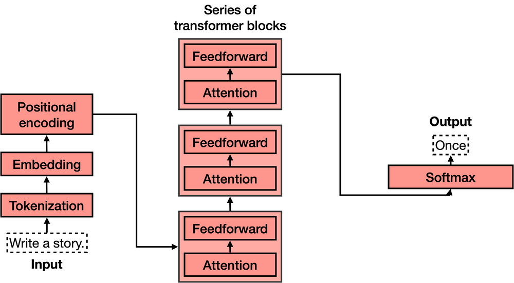
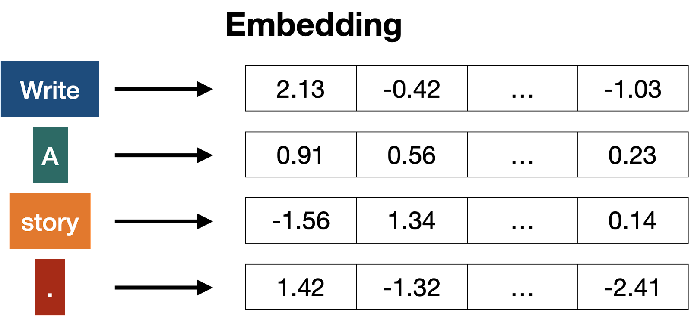
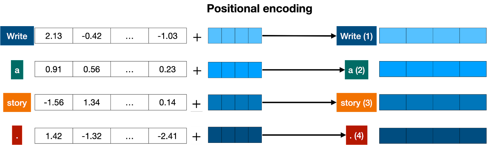

# Transformers

Transformer 4 ana parçası vardır:

- Tokenization
- Embedding
- Positional encoding
- Transformer block (several of these)
- Softmax




## Tokenization

Verilen input'u parçalara ayırma işlemidir. Tüm kelime, harf, belirteç ve noktalama işaretlerini parçalara ayırıyor.

Örnek:


## Embedding:

Gelen inputu, tokenlere ayırdıktan sonra embedding modeli ile sayısal değerlere dönüştürüyoruz.




## Positional Encoding

Transformer modeline her kelimenin sıralanışlarına dair bilgi vermek için kullanıyoruz. 

Örnek:
```
Mutlu değilim, üzgünüm.
Üzgün ​​değilim, mutluyum
```
Aynı kelimelere sahip 2 farklı cümle. Anlamları farklı. Bu yöntemi kullanarak konum bilgileri ile bilgi de taşımış oluyor.




- https://txt.cohere.com/what-are-transformer-models/
- https://docs.cohere.com/docs/transformer-models
- https://txt.cohere.com/what-is-semantic-search/

### Word and Sentence Embeddings

- https://docs.cohere.com/docs/text-embeddings
- https://txt.cohere.com/sentence-word-embeddings/

### Similarity Between Sentences

- https://docs.cohere.com/docs/similarity-between-words-and-sentences
- https://txt.cohere.com/what-is-similarity-between-sentences/
- https://txt.cohere.com/what-is-attention-in-language-models/

### Attention in Language Models

- https://docs.cohere.com/docs/the-attention-mechanism
- https://txt.cohere.com/what-is-attention-in-language-models/

### Semantic Search

- https://docs.cohere.com/docs/what-is-semantic-search
- https://txt.cohere.com/what-is-semantic-search/
https://jalammar.github.io/